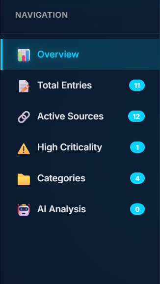
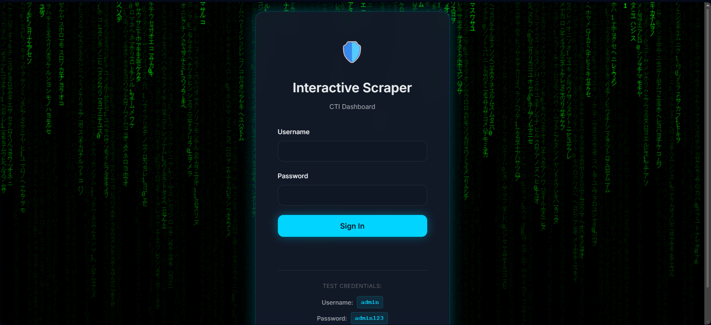
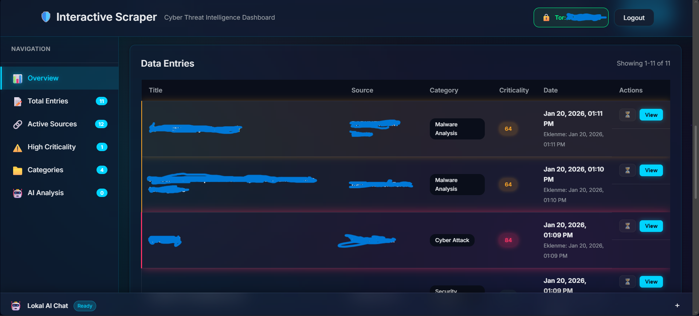
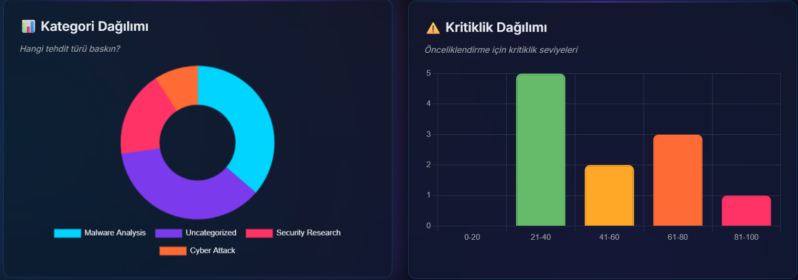
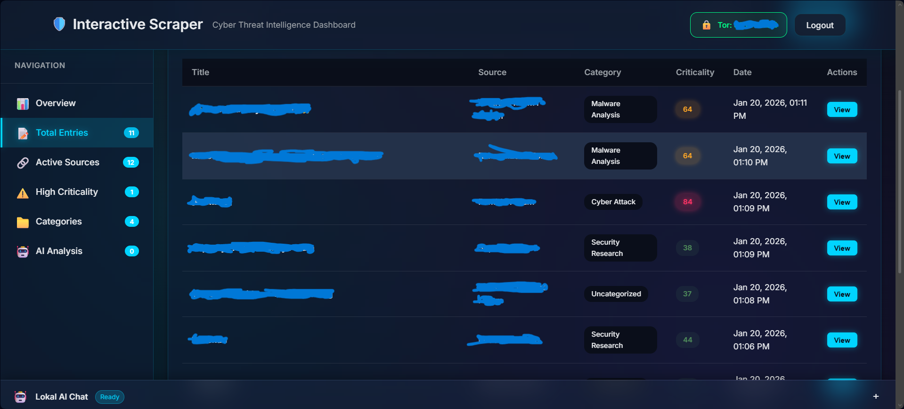
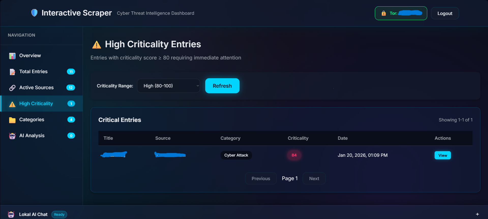
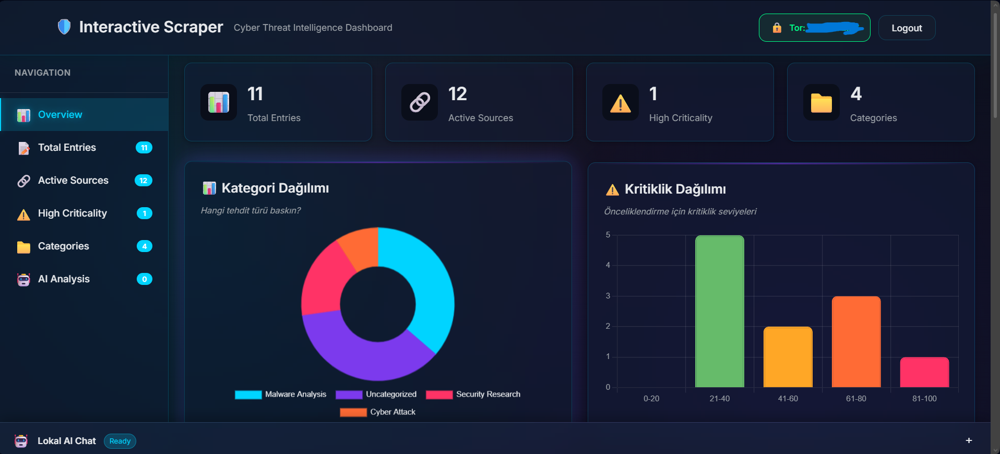
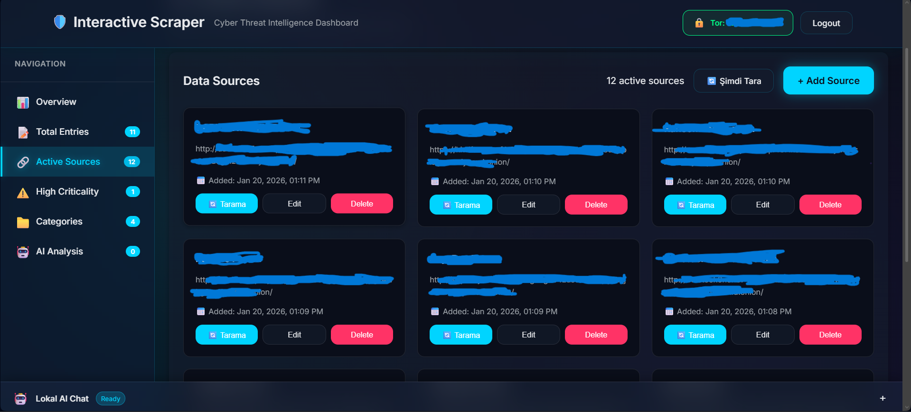
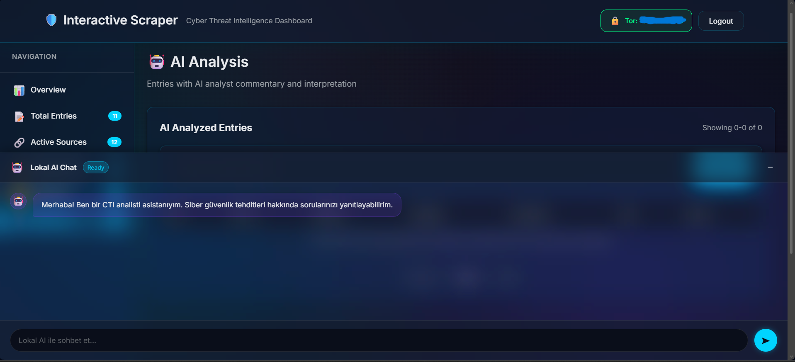

# Interactive Scraper - CTI Dashboard

A comprehensive Cyber Threat Intelligence (CTI) dashboard system for collecting, analyzing, and visualizing data from dark web sources. This project demonstrates modern web application development with a Go backend and a modern frontend interface inspired by Apple.

The following video shows the system's login screen:

<video width="100%" controls>
  <source src="./videos/demo.mp4" type="video/mp4">
  Your browser does not support video playback. [Click to download the video](./videos/demo.mp4)
</video>

**Alternative:** For direct access to the video file, [click here](./videos/demo.mp4)

## Project Overview

This project is designed to help CTI analysts visualize and manage threat intelligence data collected from various sources. The system automatically collects data, generates meaningful titles, categorizes entries, and provides an intuitive dashboard for analysis.

### Key Features



- **Automatic Data Collection**: Background service that continuously scrapes and processes data
- **Smart Title Generation**: Automatic title generation based on content analysis
- **Categorization**: Automatic categorization of entries into meaningful threat categories
- **Criticality Scoring**: Automatic criticality scoring (0-100) with manual adjustment capability
- **Modern Dashboard**: Beautiful, responsive web interface inspired by Apple's design language
- **Real-time Statistics**: Live charts and graphs showing data distribution
- **Search and Filtering**: Advanced filtering and search functionality by category
- **Secure Authentication**: JWT-based authentication system
- **Dockerized**: Fully containerized for easy deployment

## System Architecture

### Components

1. **Backend (Go)**
   - RESTful API using Gin framework
   - PostgreSQL database for data persistence
   - Background scraper service
   - JWT authentication
   - Automatic title generation and categorization

2. **Frontend**
   - Modern, responsive web interface
   - Design theme inspired by Apple
   - Interactive charts using Chart.js
   - Real-time data updates

3. **Database**
   - PostgreSQL for reliable data storage
   - Optimized schema with indexes
   - Support for sources, entries, and users

## Quick Start

### Requirements

- Docker and Docker Compose installed
- At least 2GB available RAM

### Running the Application

1. **Clone or navigate to the project directory**

2. **Start the application with Docker Compose:**

```bash
docker-compose up --build
```

This single command does the following:
- Builds the Go backend application
- Starts the PostgreSQL database
- Starts the web application
- Initializes the database schema
- Begins data collection

3. **Access the application:**

Open your browser and navigate to:
```
http://localhost:8080
```



4. **Login credentials:**

- **Username:** `admin`
- **Password:** `admin123`

> **Note:** To change the default password in production, set the `ADMIN_PASSWORD` environment variable in the `docker-compose.yml` file

## Dashboard Features

### Statistics Overview



- **Total Entries**: Number of collected data entries
- **Active Sources**: Number of monitored sources
- **High Criticality**: Number of entries with criticality score ≥ 81
- **Categories**: Number of different categories

### Visualizations



- **Category Distribution**: Donut chart showing entry distribution across categories
- **Criticality Distribution**: Bar chart showing criticality score ranges

### Data Management



- **Entry List**: Paginated table containing:
  - Title
  - Source information
  - Category
  - Criticality score
  - Creation date
- **Entry Details**: Detailed view with full content and editing capabilities
- **Search and Filtering**: Filter by category or search by keywords

### Criticality Management



- Manual adjustment of criticality scores (0-100)
- Category reassignment
- Real-time updates

## Technology Stack

### Backend
- **Go 1.21**: Modern, efficient programming language
- **Gin**: High-performance HTTP web framework
- **PostgreSQL**: Robust relational database
- **JWT**: Secure token-based authentication
- **bcrypt**: Password hashing

### Frontend
- **HTML5/CSS3**: Modern web standards
- **JavaScript (ES6+)**: Interactive functionality
- **Chart.js**: Data visualization
- **Inter Font**: Typography inspired by Apple

### Infrastructure
- **Docker**: Containerization
- **Docker Compose**: Multi-container orchestration

## Title Generation Logic

The system automatically generates titles based on content analysis. The title generation process:

1. **Content Analysis**: Analyzes cleaned content to identify main themes
2. **Category Matching**: Matches content with predefined threat categories
3. **Keyword Extraction**: Identifies important keywords and phrases
4. **Title Creation**: Creates descriptive titles that summarize the content

Generated titles are designed to be:
- **Descriptive**: Clearly indicates the nature of the content
- **Concise**: Easy to scan in lists
- **Informative**: Provides context for analysts

## Design Philosophy

The interface follows Apple's design principles:

- **Clarity**: Clear visual hierarchy and readable typography
- **Deference**: Content is the focus, UI supports it
- **Depth**: Subtle shadows and layering create visual hierarchy
- **Simplicity**: Clean, uncluttered interface
- **Consistency**: Predictable interactions and patterns

## Security Features

- **JWT Authentication**: Secure token-based authentication
- **Password Hashing**: bcrypt for secure password storage
- **CORS Protection**: Configured CORS policies
- **Input Validation**: Server-side validation of all inputs
- **SQL Injection Protection**: Parameterized queries

## Data Model

### Sources
- Source name and URL
- Creation timestamp

### Data Entries
- Title (automatically generated)
- Raw content (stored but not displayed)
- Cleaned content (shown to users)
- Share date (if available)
- Criticality score (0-100)
- Category
- Source reference
- Creation timestamp

### Users
- Username
- Hashed password
- Creation timestamp

## Development

### Project Structure

```
.
├── backend/
│   ├── main.go
│   └── internal/
|       |-- ai/
│       ├── api/          
│       ├── database/     
│       ├── scraper/      
│       └── service/      
├── frontend/
│   ├── index.html
│   └── static/
│       ├── styles.css
│       └── app.js
├── Dockerfile
├── docker-compose.yml
├── README.md
├── AI_SERVICE_SETUP.md
├── AI_TRAINING_GUIDE.md
├── images/
│   ├── dashboard-preview.png
│   ├── features.png
│   ├── dashboard-stats.png
│   ├── charts.png
│   ├── data-management.png
│   ├── criticality-management.png
│   ├── login-screen.png
│   ├── main-dashboard.png
│   ├── source-management.png
│   ├── ai-analysis.png
│   └── tor-status.png
└── videos/
    └── demo.mp4
```

### Building Locally

If you want to build and run without Docker:

1. **Install dependencies:**
```bash
go mod download
```

2. **Install PostgreSQL:**
   - Install PostgreSQL
   - Create database: `scraper_db`
   - Update connection string in code

3. **Run the application:**
```bash
cd backend
go run main.go
```

4. **Serve the frontend:**
   - Use any static file server
   - Or integrate with Go's file server

## API Endpoints

### Authentication
- `POST /api/login` - User login

### Dashboard
- `GET /api/dashboard/stats` - Get dashboard statistics

### Entries
- `GET /api/entries` - List entries (with pagination, search, filter)
- `GET /api/entries/:id` - Get entry details
- `PUT /api/entries/:id/criticality` - Update criticality score
- `PUT /api/entries/:id/category` - Update category

### Categories
- `GET /api/categories` - List all categories

All endpoints except `/api/login` require a JWT token in the `Authorization` header.

## Environment Variables

- `PORT`: Server port (default: 8080)
- `DB_HOST`: Database host (default: postgres)
- `DB_PORT`: Database port (default: 5432)
- `DB_USER`: Database user (default: postgres)
- `DB_PASSWORD`: Database password (default: postgres)
- `DB_NAME`: Database name (default: scraper_db)
- `ADMIN_PASSWORD`: Default admin password (default: admin123)

## 📸 Screenshots

### Main Dashboard


### Source Management


### AI Analysis Panel


### Tor Status Indicator


## Troubleshooting

### Database Connection Issues
- Ensure PostgreSQL container is running: `docker-compose ps`
- Check database logs: `docker-compose logs postgres`
- Verify environment variables in `docker-compose.yml` file

### Application Not Starting
- Check application logs: `docker-compose logs scraper`
- Verify port 8080 is not in use
- Ensure Docker has allocated sufficient resources

### Data Not Appearing
- Wait 30-60 seconds for initial data collection
- Check scraper logs: `docker-compose logs scraper`
- Verify data exists in database: Connect to database and query `data_entries` table

## License

This project was developed for educational purposes as part of a CTI analysis course.


## Future Improvements

Potential improvements:
- Real-time WebSocket updates
- Advanced search with full-text search
- Export functionality (CSV, JSON)
- Email notifications for high criticality entries
- Multi-user support with roles
- API rate limiting
- Advanced logging and monitoring
- Automatic threat intelligence enrichment

---

**Important Note**: This system is designed for educational purposes. In production environments, ensure you take appropriate security measures, use strong passwords, enable HTTPS, and follow security best practices.
